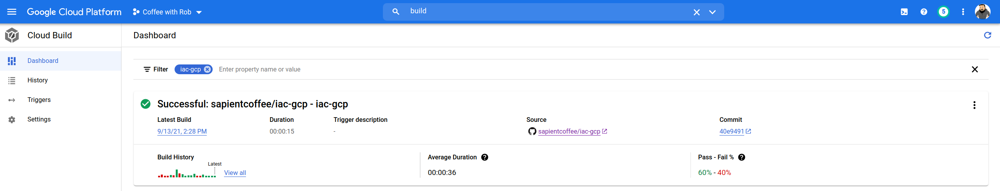
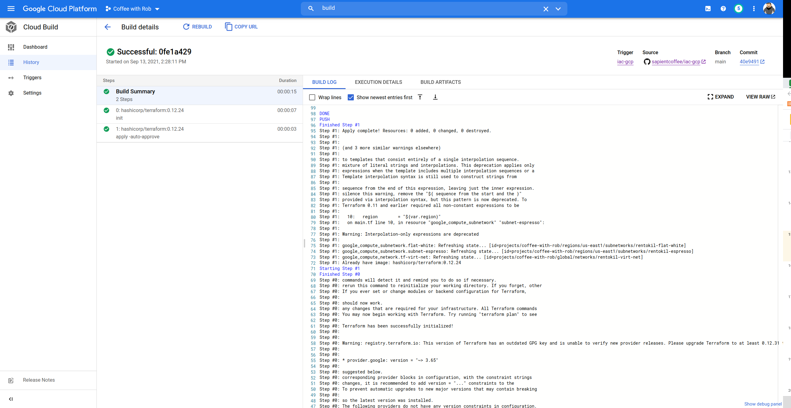
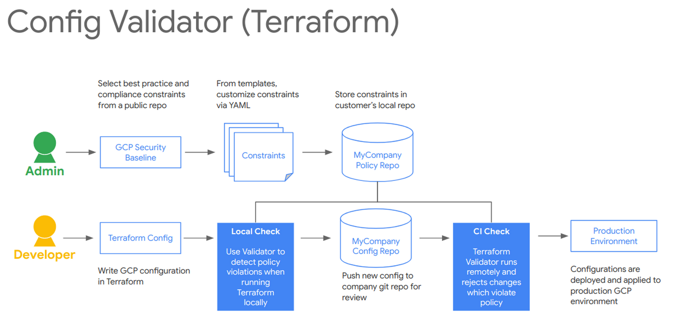

# Demo IAC with GCP
This is a simple demo to highlight how "infrastructure as code" can be used to configure networking and webservers in GCP. It has been created for demo purposes

[](https://console.cloud.google.com/cloudshell/open?git_repo=https://github.com/SapientCoffee/iac-gcp.git)

## Clickops
Traditional "click ops" options of ustilising the GUI to create resources.

Create and update various firewall or network settings.

## Scripts
You could script these options with your language of choice 


## Terraform

### Local
```bash
cd terraform
```
```hcl
terraform init
terraform plan
```

```hcl
terraform apply
```

If you look in the directory you will see a local state file, how do we make this remote?


Its just as easy to remove the config
```hcl
terraform destroy
```

### GCS remote state
Uncomment the `state.tf` contents

```hcl
terraform apply
```

The `terraform` cli will walk through the directory and read all the `.tf` files.

Great we now have the ability to codify our configuration and the state is stored somewhere safe (I hope). Now how can multiple engineers work on the infrastructure?

## Git
Developers have been using `git` for years, but it doenst mean source control is limited to only developers. We can utilse it to hlp operations or infrastructure teams.

Show the git (in my case GitHub) UI to highlight
* History
* audit 
* click around the GitHub UI and show some of the `git` CLI explaining what it is doing.

Now that we have the configuration and state stored in a remote location this enables us to leverage another practice that has serveed the development world well and helps with automation to reduce the chance of human error and also execute changes as soon as approval occurd (in you have that step)

## Cloud Build

The advantage of pipline stuff with Cloud Build is that you can add additonal steps before and after execution;
* Pre-flight checks
* Post flight checks
* Config validation
* Security analysis
* chat channel notifications

I have used cloud build;




When you create the cloud build job you specify a `yaml` file with instuctions of what to do.

Our example is `cloudbuild.yaml` that does 2 things, `terraform init` & `terraform apply` using a container to execute the commands in.

```yaml
steps:
- name: 'hashicorp/terraform:1.0.6'
  env:
  - 'GOOGLE_CLOUD_PROJECT=${PROJECT_ID}'
  dir: 'terraform/'
  args: ['init']

- name: 'hashicorp/terraform:1.0.6'
  env:
  - 'GOOGLE_CLOUD_PROJECT=${PROJECT_ID}'
  dir: 'terraform/'
  args: ['apply', '-auto-approve']
```

### Trigger
Create a trigger so that when push is done in git it auto "builds" - show the pippeline that already exist

## Change

Trigger a change with a PR to show one way of doing approval and/or show it via Cloud Build

```bash
git checkout -b new-feature
```

alter something

```bash
git push --set-upstream origin new-feature
git checkout main
```

Accept PR in GitHub UI
Show the Cloud Build pipeline has kicked off

git checkout main

Notice that the stuff just changed is not local ... need to do a `git pull`


## Validator step

Enable the trigger - https://pantheon.corp.google.com/cloud-build/triggers/edit/b0fd3584-430f-48be-852c-ab422815e638?project=coffee-with-rob



## Config Export
What if I have already configured a project, can I export what TF could look like?

(pick out the network & firewall exports from the `gcloud beta resource-config bulk-export` command)

```bash
gcloud beta resource-config bulk-export --resource-format=terraform --project coffee-with-rob --path terraform\
        --resource-types ComputeInstance,ComputeNetwork,ComputeSubnetwork,ComputeFirewall,Service
```

## Modules
A Terraform module is a set of Terraform configuration files in a single directory. Even a simple configuration consisting of a single directory with one or more .tf files is a module.

It makes it easier to creaet reusable templates.

The example here is the deployment of a web server with firewall and network config (terraform/web.tf)

```hcl
module "vpc" {
  source  = "../modules/vpc"
  project = "${var.project}"
  env     = "${var.env}"
}

module "http_server" {
  source  = "../modules/http_server"
  project = "${var.project}"
  subnet  = "${module.vpc.subnet}"
}

module "firewall" {
  source  = "../modules/firewall"
  project = "${var.project}"
  subnet  = "${module.vpc.subnet}"
}
```

I will also show how you can export config settings (terraform/output.tf)

```hcl
output "network" {
  value = "${module.vpc.network}"
}

output "subnet" {
  value = "${module.vpc.subnet}"
}

output "firewall_rule" {
  value = "${module.firewall.firewall_rule}"
}

output "instance_name" {
  value = "${module.http_server.instance_name}"
}

output "external_ip" {
  value = "${module.http_server.external_ip}"
}
```

Now if I commit the changes and push to the repo the Cloud Build pipeline shoudl kick off and deploy the webserver and output the details we requested.

## Staging
Show the example from https://cloud.google.com/architecture/managing-infrastructure-as-code

http://iac.gcp-demo.coffee
https://pantheon.corp.google.com/cloud-build/builds;region=global/742f7c4d-66b9-4563-94e6-4d92a2a60f6b?project=coffee-with-rob

# Clean up

```bash
terraform destroy
```

# License

```text
Copyright 2018-2021 Rob Edwards
Copyright 2018-2021 Google, Inc.

Licensed under the Apache License, Version 2.0 (the "License");
you may not use this file except in compliance with the License.
You may obtain a copy of the License at

    http://www.apache.org/licenses/LICENSE-2.0

Unless required by applicable law or agreed to in writing, software
distributed under the License is distributed on an "AS IS" BASIS,
WITHOUT WARRANTIES OR CONDITIONS OF ANY KIND, either express or implied.
See the License for the specific language governing permissions and
limitations under the License.
```

[hashicorp-installer]: https://github.com/sethvargo/hashicorp-installer
[terraform]: https://www.terraform.io/
[gcp]: https://cloud.google.com/
[gcpgke]: https://cloud.google.com/kubernetes-engine/
[gcpsr]: https://cloud.google.com/source-repositories
[gcpstorage]: https://cloud.google.com/storage
[gcpb]: https://cloud.google.com/cloud-build
[gcpcs]: https://cloud.google.com/shell
[gcloud]: https://cloud.google.com/sdk
[chrome-incognito]: https://support.google.com/chrome/answer/95464?co=GENIE.Platform%3DDesktop&hl=en
