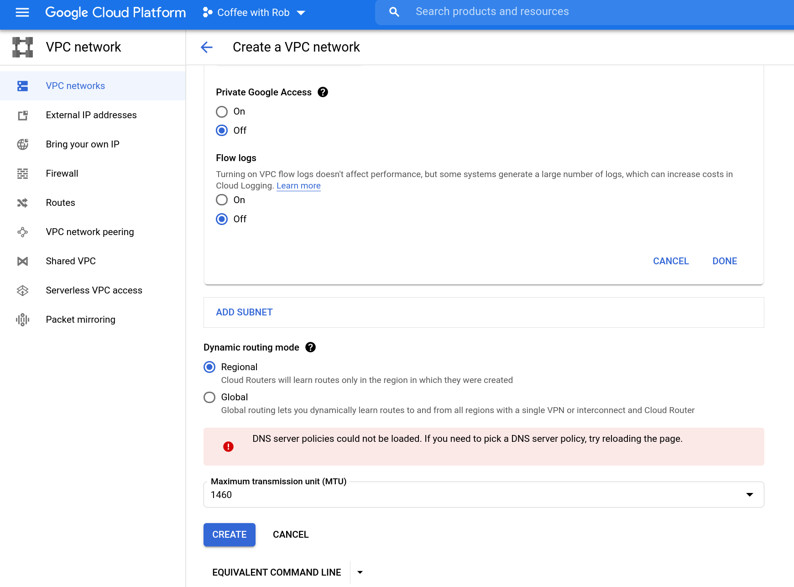
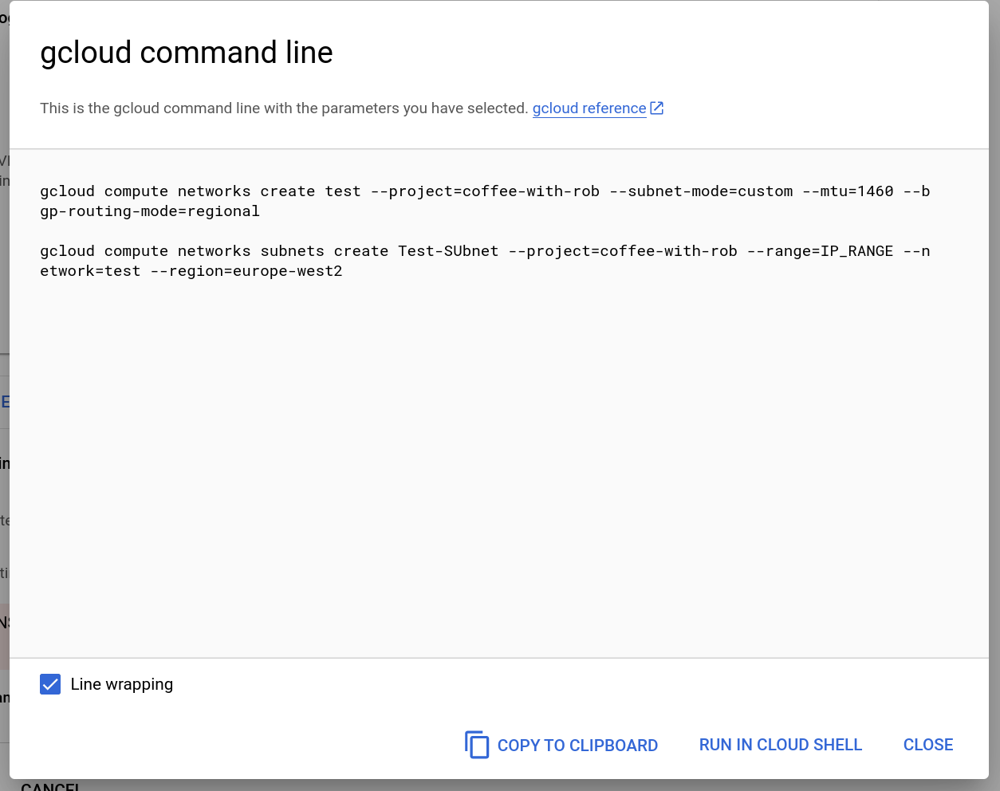

# Demo IAC with GCP


[](https://console.cloud.google.com/cloudshell/open?git_repo=https://github.com/SapientCoffee/iac-gcp.git)

## Clickops
Traditional "click ops" options of ustilising the GUI to create resources.

Create and update various firewall or network settings.

## Scripts
You could script these options with your language of choice 




## Terraform

### Local
cd terraform
terraform init

### GCS remote state
UNcomment the `state.tf` contents
terraform apply

## Git
History/audit - click around the GitHub UI and show some of the `git` CLI explaining what it is doing.

## Cloud Build
Now we have stuff in Git could we automate the deployment and testing?

Show cloud build and explain what it is doing and run an example.

### Trigger
Create a trigger so that when push is done in git it auto "builds"

## Change
Trigger a change with a PR to show one way of doing approval and/or show it via Cloud Build


git checkout -b new-feature

alter something

git push --set-upstream origin new-feature
git checkout main

Accept PR in GitHub UI
Show the Cloud Build pipeline has kicked off


## Validator step

Add the GCP validator into the mix

## Config Export
What if I have already configured a project, can I export what TF could look like?

(pick out the network & firewall exports from the `gcloud beta` command)

## Modules
Discuss and highlight modules with the other TF files (create webserver etc.)

## Staging
Show the example from https://cloud.google.com/architecture/managing-infrastructure-as-code

# License

```text
Copyright 2018-2021 Rob Edwards
Copyright 2018-2021 Google, Inc.

Licensed under the Apache License, Version 2.0 (the "License");
you may not use this file except in compliance with the License.
You may obtain a copy of the License at

    http://www.apache.org/licenses/LICENSE-2.0

Unless required by applicable law or agreed to in writing, software
distributed under the License is distributed on an "AS IS" BASIS,
WITHOUT WARRANTIES OR CONDITIONS OF ANY KIND, either express or implied.
See the License for the specific language governing permissions and
limitations under the License.
```

[hashicorp-installer]: https://github.com/sethvargo/hashicorp-installer
[terraform]: https://www.terraform.io/
[gcp]: https://cloud.google.com/
[gcpgke]: https://cloud.google.com/kubernetes-engine/
[gcpsr]: https://cloud.google.com/source-repositories
[gcpstorage]: https://cloud.google.com/storage
[gcpb]: https://cloud.google.com/cloud-build
[gcpcs]: https://cloud.google.com/shell
[gcloud]: https://cloud.google.com/sdk
[chrome-incognito]: https://support.google.com/chrome/answer/95464?co=GENIE.Platform%3DDesktop&hl=en
